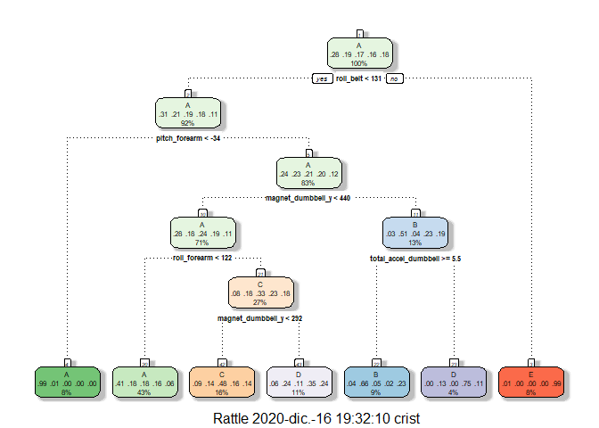
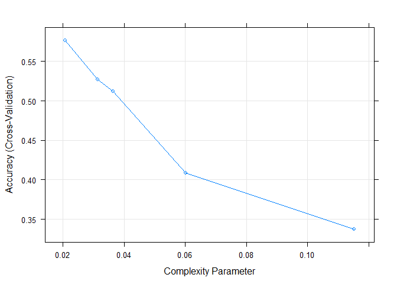
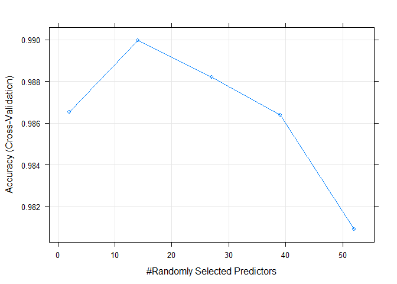
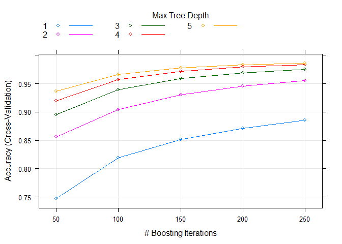

# Overview
This is the final report for Coursera’s Practical Machine Learning course, as part of the Data Science Specialization track offered by John Hopkins. 

In this project, we will use data from accelerometers on the belt, forearm, arm, and dumbell of 6 participants to predict the manner in which they did the exercise. This is the “classe” variable in the training set. We train 4 models: **Decision Tree**, **Random Forest**, **Gradient Boosted Trees**, **Support Vector Machine** using k-folds cross validation on the training set. We then predict using a validation set randomly selected from the training csv data to obtain the **accuracy** and **out of sample error rate**. Based on those numbers, we decide on the best model, and use it to predict 20 cases using the test csv set. 


# Background
Using devices such as Jawbone Up, Nike FuelBand, and Fitbit it is now possible to collect a large amount of data about personal activity relatively inexpensively. These type of devices are part of the quantified self movement - a group of enthusiasts who take measurements about themselves regularly to improve their health, to find patterns in their behavior, or because they are tech geeks. One thing that people regularly do is quantify how much of a particular activity they do, but they rarely quantify how well they do it. In this project, your goal will be to use data from accelerometers on the belt, forearm, arm, and dumbell of 6 participants. They were asked to perform barbell lifts correctly and incorrectly in 5 different ways. More information is available from the website here: (http://groupware.les.inf.puc-rio.br/har) (see the section on the Weight Lifting Exercise Dataset).

The training data for this project are available here:

**https://d396qusza40orc.cloudfront.net/predmachlearn/pml-training.csv**

The test data are available here:

**https://d396qusza40orc.cloudfront.net/predmachlearn/pml-testing.csv**


# Loading Data and Libraries


```r
library(lattice)
library(ggplot2)
library(caret)
library(kernlab)
library(rattle)
library(corrplot)
set.seed(1234)
```

## Download Data


```r
URL_training="https://d396qusza40orc.cloudfront.net/predmachlearn/pml-training.csv"
URL_testing="https://d396qusza40orc.cloudfront.net/predmachlearn/pml-testing.csv"
download.file(URL_training, "pml-training.csv")
download.file(URL_training,"pml-testing.csv")
```

## Read Data

```r
traincsv <- read.csv("pml-training.csv")
testcsv <- read.csv("pml-testing.csv")

dim(traincsv)
```

```
## [1] 19622   160
```

```r
dim(testcsv)
```

```
## [1] 19622   160
```

We see that there are 160 variables and 19622 observations in the training set, while 20 for the test set.


# Cleaning the Data

Removing unnecessary variables. Starting with N/A variables.

```r
traincsv <- traincsv[,colMeans(is.na(traincsv)) < .9] #removing mostly na columns
traincsv <- traincsv[,-c(1:7)] #removing metadata which is irrelevant to the outcome
```

Removing near zero variance variables.

```r
nvz <- nearZeroVar(traincsv)
traincsv <- traincsv[,-nvz]
dim(traincsv)
```

```
## [1] 19622    53
```

Now that we have finished removing the unnecessary variables, we can now split the training set into a **validation** and sub **training** set. The testing set "testcsv" will be left alone, and used for the final quiz test cases. 

```r
inTrain <- createDataPartition(y=traincsv$classe, p=0.7, list=F)
train <- traincsv[inTrain,]
valid <- traincsv[-inTrain,]
```


# Creating and Testing the Models
Here we will test a few popular models including: **Decision Trees**, **Random Forest**, **Gradient Boosted Trees**, and **SVM**. This is probably more than we will need to test, but just out of curiosity and good practice we will run them for comparison.

Set up control for training to use 3-fold cross validation. 

```r
control <- trainControl(method="cv", number=3, verboseIter=F)
```

## Decision Tree

**Model:** 


```r
mod_trees <- train(classe~., data=train, method="rpart", trControl = control, tuneLength = 5)
fancyRpartPlot(mod_trees$finalModel)
```

<!-- -->

**Prediction:**


```r
pred_trees <- predict(mod_trees, valid)
cmtrees <- confusionMatrix(pred_trees, factor(valid$classe))
cmtrees
```

```
## Confusion Matrix and Statistics
## 
##           Reference
## Prediction    A    B    C    D    E
##          A 1519  473  484  451  156
##          B   28  355   45   10  130
##          C   83  117  423  131  131
##          D   40  194   74  372  176
##          E    4    0    0    0  489
## 
## Overall Statistics
##                                           
##                Accuracy : 0.5366          
##                  95% CI : (0.5238, 0.5494)
##     No Information Rate : 0.2845          
##     P-Value [Acc > NIR] : < 2.2e-16       
##                                           
##                   Kappa : 0.3957          
##                                           
##  Mcnemar's Test P-Value : < 2.2e-16       
## 
## Statistics by Class:
## 
##                      Class: A Class: B Class: C Class: D Class: E
## Sensitivity            0.9074  0.31168  0.41228  0.38589  0.45194
## Specificity            0.6286  0.95512  0.90492  0.90165  0.99917
## Pos Pred Value         0.4927  0.62500  0.47797  0.43458  0.99189
## Neg Pred Value         0.9447  0.85255  0.87940  0.88228  0.89002
## Prevalence             0.2845  0.19354  0.17434  0.16381  0.18386
## Detection Rate         0.2581  0.06032  0.07188  0.06321  0.08309
## Detection Prevalence   0.5239  0.09652  0.15038  0.14545  0.08377
## Balanced Accuracy      0.7680  0.63340  0.65860  0.64377  0.72555
```

## Random Forest


```r
mod_rf <- train(classe~., data=train, method="rf", trControl = control, tuneLength = 5)

pred_rf <- predict(mod_rf, valid)
cmrf <- confusionMatrix(pred_rf, factor(valid$classe))
cmrf
```

```
## Confusion Matrix and Statistics
## 
##           Reference
## Prediction    A    B    C    D    E
##          A 1673    4    0    0    0
##          B    1 1132    8    0    0
##          C    0    3 1016    5    1
##          D    0    0    2  958    0
##          E    0    0    0    1 1081
## 
## Overall Statistics
##                                           
##                Accuracy : 0.9958          
##                  95% CI : (0.9937, 0.9972)
##     No Information Rate : 0.2845          
##     P-Value [Acc > NIR] : < 2.2e-16       
##                                           
##                   Kappa : 0.9946          
##                                           
##  Mcnemar's Test P-Value : NA              
## 
## Statistics by Class:
## 
##                      Class: A Class: B Class: C Class: D Class: E
## Sensitivity            0.9994   0.9939   0.9903   0.9938   0.9991
## Specificity            0.9991   0.9981   0.9981   0.9996   0.9998
## Pos Pred Value         0.9976   0.9921   0.9912   0.9979   0.9991
## Neg Pred Value         0.9998   0.9985   0.9979   0.9988   0.9998
## Prevalence             0.2845   0.1935   0.1743   0.1638   0.1839
## Detection Rate         0.2843   0.1924   0.1726   0.1628   0.1837
## Detection Prevalence   0.2850   0.1939   0.1742   0.1631   0.1839
## Balanced Accuracy      0.9992   0.9960   0.9942   0.9967   0.9994
```

## Gradient Boosted Trees


```r
mod_gbm <- train(classe~., data=train, method="gbm", trControl = control, tuneLength = 5, verbose = F)

pred_gbm <- predict(mod_gbm, valid)
cmgbm <- confusionMatrix(pred_gbm, factor(valid$classe))
cmgbm
```

```
## Confusion Matrix and Statistics
## 
##           Reference
## Prediction    A    B    C    D    E
##          A 1671    5    0    0    0
##          B    1 1128   15    0    0
##          C    2    6 1007    8    4
##          D    0    0    4  953    1
##          E    0    0    0    3 1077
## 
## Overall Statistics
##                                          
##                Accuracy : 0.9917         
##                  95% CI : (0.989, 0.9938)
##     No Information Rate : 0.2845         
##     P-Value [Acc > NIR] : < 2.2e-16      
##                                          
##                   Kappa : 0.9895         
##                                          
##  Mcnemar's Test P-Value : NA             
## 
## Statistics by Class:
## 
##                      Class: A Class: B Class: C Class: D Class: E
## Sensitivity            0.9982   0.9903   0.9815   0.9886   0.9954
## Specificity            0.9988   0.9966   0.9959   0.9990   0.9994
## Pos Pred Value         0.9970   0.9860   0.9805   0.9948   0.9972
## Neg Pred Value         0.9993   0.9977   0.9961   0.9978   0.9990
## Prevalence             0.2845   0.1935   0.1743   0.1638   0.1839
## Detection Rate         0.2839   0.1917   0.1711   0.1619   0.1830
## Detection Prevalence   0.2848   0.1944   0.1745   0.1628   0.1835
## Balanced Accuracy      0.9985   0.9935   0.9887   0.9938   0.9974
```

## Support Vector Machine


```r
mod_svm <- train(classe~., data=train, method="svmLinear", trControl = control, tuneLength = 5, verbose = F)

pred_svm <- predict(mod_svm, valid)
cmsvm <- confusionMatrix(pred_svm, factor(valid$classe))
cmsvm
```

```
## Confusion Matrix and Statistics
## 
##           Reference
## Prediction    A    B    C    D    E
##          A 1537  154   79   69   50
##          B   29  806   90   46  152
##          C   40   81  797  114   69
##          D   61   22   32  697   50
##          E    7   76   28   38  761
## 
## Overall Statistics
##                                           
##                Accuracy : 0.7813          
##                  95% CI : (0.7705, 0.7918)
##     No Information Rate : 0.2845          
##     P-Value [Acc > NIR] : < 2.2e-16       
##                                           
##                   Kappa : 0.722           
##                                           
##  Mcnemar's Test P-Value : < 2.2e-16       
## 
## Statistics by Class:
## 
##                      Class: A Class: B Class: C Class: D Class: E
## Sensitivity            0.9182   0.7076   0.7768   0.7230   0.7033
## Specificity            0.9164   0.9332   0.9374   0.9665   0.9690
## Pos Pred Value         0.8137   0.7177   0.7239   0.8086   0.8363
## Neg Pred Value         0.9657   0.9301   0.9521   0.9468   0.9355
## Prevalence             0.2845   0.1935   0.1743   0.1638   0.1839
## Detection Rate         0.2612   0.1370   0.1354   0.1184   0.1293
## Detection Prevalence   0.3210   0.1908   0.1871   0.1465   0.1546
## Balanced Accuracy      0.9173   0.8204   0.8571   0.8447   0.8362
```

## Results (Accuracy & Out of Sample Error)


```
##      accuracy oos_error
## Tree    0.537     0.463
## RF      0.996     0.004
## GBM     0.992     0.008
## SVM     0.781     0.219
```

**The best model is the Random Forest model, with 0.9957519 accuracy and 0.0042481 out of sample error rate. We find that to be a sufficient enough model to use for our test sets. ** 


# Predictions on Test Set

Running our test set to predict the classe (5 levels) outcome for 20 cases with the **Random Forest** model.

```r
pred <- predict(mod_rf, testcsv)
print(pred)
```

```
##     [1] A A A A A A A A A A A A A A A A A A A A A A A A A A A A A A A A A A A A
##    [37] A A A A A A A A A A A A A A A A A A A A A A A A A A A A A A A A A A A A
##    [73] A A A A A A A A A A A A A A A A A A A A A A A A A A A A A A A A A A A A
##   [109] A A A A A A A A A A A A A A A A A A A A A A A A A A A A A A A A A A A A
##   [145] A A A A A A A A A A A A A A A A A A A A A A A A A A A A A A A A A A A A
##   [181] A A A A A A A A A A A A A A A A A A A A A A A A A A A A A A A A A A A A
##   [217] A A A A A A A A A A A A A A A A A A A A A A A A A A A A A A A A A A A A
##   [253] A A A A A A A A A A A A A A A A A A A A A A A A A A A A A A A A A A A A
##   [289] A A A A A A A A A A A A A A A A A A A A A A A A A A A A A A A A A A A A
##   [325] A A A A A A A A A A A A A A A A A A A A A A A A A A A A A A A A A A A A
##   [361] A A A A A A A A A A A A A A A A A A A A A A A A A A A A A A A A A A A A
##   [397] A A A A A A A A A A A A A A A A A A A A A A A A A A A A A A A A A A A A
##   [433] A A A A A A A A A A A A A A A A A A A A A A A A A A A A A A A A A A A A
##   [469] A A A A A A A A A A A A A A A A A A A A A A A A A A A A A A A A A A A A
##   [505] A A A A A A A A A A A A A A A A A A A A A A A A A A A A A A A A A A A A
##   [541] A A A A A A A A A A A A A A A A A A A A A A A A A A A A A A A A A A A A
##   [577] A A A A A A A A A A A A A A A A A A A A A A A A A A A A A A A A A A A A
##   [613] A A A A A A A A A A A A A A A A A A A A A A A A A A A A A A A A A A A A
##   [649] A A A A A A A A A A A A A A A A A A A A A A A A A A A A A A A A A A A A
##   [685] A A A A A A A A A A A A A A A A A A A A A A A A A A A A A A A A A A A A
##   [721] A A A A A A A A A A A A A A A A A A A A A A A A A A A A A A A A A A A A
##   [757] A A A A A A A A A A A A A A A A A A A A A A A A A A A A A A A A A A A A
##   [793] A A A A A A A A A A A A A A A A A A A A A A A A A A A A A A A A A A A A
##   [829] A A A A A A A A A A A A A A A A A A A A A A A A A A A A A A A A A A A A
##   [865] A A A A A A A A A A A A A A A A A A A A A A A A A A A A A A A A A A A A
##   [901] A A A A A A A A A A A A A A A A A A A A A A A A A A A A A A A A A A A A
##   [937] A A A A A A A A A A A A A A A A A A A A A A A A A A A A A A A A A A A A
##   [973] A A A A A A A A A A A A A A A A A A A A A A A A A A A A A A A A A A A A
##  [1009] A A A A A A A A A A A A A A A A A A A A A A A A A A A A A A A A A A A A
##  [1045] A A A A A A A A A A A A A A A A A A A A A A A A A A A A A A A A A A A A
##  [1081] A A A A A A A A A A A A A A A A A A A A A A A A A A A A A A A A A A A A
##  [1117] A A A A A A A A A A A A A A A A A A A A A A A A A A A A A A A A A A A A
##  [1153] A A A A A A A A A A A A A A A A A A A A A A A A A A A A A A A A A A A A
##  [1189] A A A A A A A A A A A A A A A A A A A A A A A A A A A A A A A A A A A A
##  [1225] A A A A A A A A A A A A A A A A A A A A A A A A A A A A A A A A A A A A
##  [1261] A A A A A A A A A A A A A A A A A A A A A A A A A A A A A A A A A A A A
##  [1297] A A A A A A A A A A A A A A A A A A A A A A A A A A A A A A A A A A A A
##  [1333] A A A A A A A A A A A A A A A A A A A A A A A A A A A A A A A A A A A A
##  [1369] A A A A A A A A A A A A A A A A A A A A A A A A A A A A A A A A A A A A
##  [1405] A A A A A A A A A A A A A A A A A A A A A A A A A A A A A A A A A A A A
##  [1441] A A A A A A A A A A A A A A A A A A A A A A A A A A A A A A A A A A A A
##  [1477] A A A A A A A A A A A A A A A A A A A A A A A A A A A A A A A A A A A A
##  [1513] A A A A A A A A A A A A A A A A A A A A A A A A A A A A A A A A A A A A
##  [1549] A A A A A A A A A A A A A A A A A A A A A A A A A A A A A A A A A A A A
##  [1585] A A A A A A A A A A A A A A A A A A A A A A A A A A A A A A A A A A A A
##  [1621] A A A A A A A A A A A A A A A A A A A A A A A A A A A A A A A A A A A A
##  [1657] A A A A A A A A A A A A A A A A A A A A A A A A A A A A A A A A A A A A
##  [1693] A A A A A A A A A A A A A A A A A A A A A A A A A A A A A A A A A A A A
##  [1729] A A A A A A A A A A A A A A A A A A A A A A A A A A A A A A A A A A A A
##  [1765] A A A A A A A A A A A A A A A A A A A A A A A A A A A A A A A A A A A A
##  [1801] A A A A A A A A A A A A A A A A A A A A A A A A A A A A A A A A A A A A
##  [1837] A A A A A A A A A A A A A A A A A A A A A A A A A A A A A A A A A A A A
##  [1873] A A A A A A A A A A A A A A A A A A A A A A A A A A A A A A A A A A A A
##  [1909] A A A A A A A A A A A A A A A A A A A A A A A A A A A A A A A A A A A A
##  [1945] A A A A A A A A A A A A A A A A A A A A A A A A A A A A A A A A A A A A
##  [1981] A A A A A A A A A A A A A A A A A A A A A A A A A A A A A A A A A A A A
##  [2017] A A A A A A A A A A A A A A A A A A A A A A A A A A A A A A A A A A A A
##  [2053] A A A A A A A A A A A A A A A A A A A A A A A A A A A A A A A A A A A A
##  [2089] A A A A A A A A A A A A A A A A A A A A A A A A A A A A A A A A A A A A
##  [2125] A A A A A A A A A A A A A A A A A A A A A A A A A A A A A A A A A A A A
##  [2161] A A A A A A A A A A A A A A A A A A A A A A A A A A A A A A A A A A A A
##  [2197] A A A A A A A A A A A A A A A A A A A A A A A A A A A A A A A A A A A A
##  [2233] A A A A A A A A A A A A A A A A A A A A A A A A A A A A A A A A A A A A
##  [2269] A A A A A A A A A A A A A A A A A A A A A A A A A A A A A A A A A A A A
##  [2305] A A A A A A A A A A A A A A A A A A A A A A A A A A A A A A A A A A A A
##  [2341] A A A A A A A A A A A A A A A A A A A A A A A A A A A A A A A A A A A A
##  [2377] A A A A A A A A A A A A A A A A A A A A A A A A A A A A A A A A A A A A
##  [2413] A A A A A A A A A A A A A A A A A A A A A A A A A A A A A A A A A A A A
##  [2449] A A A A A A A A A A A A A A A A A A A A A A A A A A A A A A A A A A A A
##  [2485] A A A A A A A A A A A A A A A A A A A A A A A A A A A A A A A A A A A A
##  [2521] A A A A A A A A A A A A A A A A A A A A A A A A A A A A A A A A A A A A
##  [2557] A A A A A A A A A A A A A A A A A A A A A A A A A A A A A A A A A A A A
##  [2593] A A A A A A A A A A A A A A A A A A A A A A A A A A A A A A A A A A A A
##  [2629] A A A A A A A A A A A A A A A A A A A A A A A A A A A A A A A A A A A A
##  [2665] A A A A A A A A A A A A A A A A A A A A A A A A A A A A A A A A A A A A
##  [2701] A A A A A A A A A A A A A A A A A A A A A A A A A A A A A A A A A A A A
##  [2737] A A A A A A A A A A A A A A A A A A A A A A A A A A A A A A A A A A A A
##  [2773] A A A A A A A A A A A A A A A A A A A A A A A A A A A A A A A A A A A A
##  [2809] A A A A A A A A A A A A A A A A A A A A A A A A A A A A A A A A A A A A
##  [2845] A A A A A A A A A A A A A A A A A A A A A A A A A A A A A A A A A A A A
##  [2881] A A A A A A A A A A A A A A A A A A A A A A A A A A A A A A A A A A A A
##  [2917] A A A A A A A A A A A A A A A A A A A A A A A A A A A A A A A A A A A A
##  [2953] A A A A A A A A A A A A A A A A A A A A A A A A A A A A A A A A A A A A
##  [2989] A A A A A A A A A A A A A A A A A A A A A A A A A A A A A A A A A A A A
##  [3025] A A A A A A A A A A A A A A A A A A A A A A A A A A A A A A A A A A A A
##  [3061] A A A A A A A A A A A A A A A A A A A A A A A A A A A A A A A A A A A A
##  [3097] A A A A A A A A A A A A A A A A A A A A A A A A A A A A A A A A A A A A
##  [3133] A A A A A A A A A A A A A A A A A A A A A A A A A A A A A A A A A A A A
##  [3169] A A A A A A A A A A A A A A A A A A A A A A A A A A A A A A A A A A A A
##  [3205] A A A A A A A A A A A A A A A A A A A A A A A A A A A A A A A A A A A A
##  [3241] A A A A A A A A A A A A A A A A A A A A A A A A A A A A A A A A A A A A
##  [3277] A A A A A A A A A A A A A A A A A A A A A A A A A A A A A A A A A A A A
##  [3313] A A A A A A A A A A A A A A A A A A A A A A A A A A A A A A A A A A A A
##  [3349] A A A A A A A A A A A A A A A A A A A A A A A A A A A A A A A A A A A A
##  [3385] A A A A A A A A A A A A A A A A A A A A A A A A A A A A A A A A A A A A
##  [3421] A A A A A A A A A A A A A A A A A A A A A A A A A A A A A A A A A A A A
##  [3457] A A A A A A A A A A A A A A A A A A A A A A A A A A A A A A A A A A A A
##  [3493] A A A A A A A A A A A A A A A A A A A A A A A A A A A A A A A A A A A A
##  [3529] A A A A A A A A A A A A A A A A A A A A A A A A A A A A A A A A A A A A
##  [3565] A A A A A A A A A A A A A A A A A A A A A A A A A A A A A A A A A A A A
##  [3601] A A A A A A A A A A A A A A A A A A A A A A A A A A A A A A A A A A A A
##  [3637] A A A A A A A A A A A A A A A A A A A A A A A A A A A A A A A A A A A A
##  [3673] A A A A A A A A A A A A A A A A A A A A A A A A A A A A A A A A A A A A
##  [3709] A A A A A A A A A A A A A A A A A A A A A A A A A A A A A A A A A A A A
##  [3745] A A A A A A A A A A A A A A A A A A A A A A A A A A A A A A A A A A A A
##  [3781] A A A A A A A A A A A A A A A A A A A A A A A A A A A A A A A A A A A A
##  [3817] A A A A A A A A A A A A A A A A A A A A A A A A A A A A A A A A A A A A
##  [3853] A A A A A A A A A A A A A A A A A A A A A A A A A A A A A A A A A A A A
##  [3889] A A A A A A A A A A A A A A A A A A A A A A A A A A A A A A A A A A A A
##  [3925] A A A A A A A A A A A A A A A A A A A A A A A A A A A A B A A A A A A A
##  [3961] A A A A A A A A A A A A A A A A A A A A A A A A A A A A A A A A A A A A
##  [3997] A A A A A A A A A A A A A A A A A A A A A A A A A A A A A A A A A A A A
##  [4033] A A A A A A A A A A A A A A A A A A A A A A A A A A A A A A A A A A A A
##  [4069] A A A A A A A A A A A A A A A A A A A A A A A A A A A A A A A A A A A A
##  [4105] A A A A A A A A A A A A A A A A A A A A A A A A A A A A A A A A A A A A
##  [4141] A A A A A A A A A A A A A A A A A A A A A A A A A A A A A A A A A A A A
##  [4177] A A A A A A A A A A A A A A A A A A A A A A A A A A A A A A A A A A A A
##  [4213] A A A A A A A A A A A A A A A A A A A A A A A A A A A A A A A A A A A A
##  [4249] A A A A A A A A A A A A A A A A A A A A A A A A A A A A A A A A A A A A
##  [4285] A A A A A A A A A A A A A A A A A A A A A A A A A A A A A A A A A A A A
##  [4321] A A A A A A A A A A A A A A A A A A A A A A A A A A A A A A A A A A A A
##  [4357] A A A A A A A A A A A A A A A A A A A A A A A A A A A A A A A A A A A A
##  [4393] A A A A A A A A A A A A A A A A A A A A A A A A A A A A A A A A A A A A
##  [4429] A A A A A A A A A A A A A A A A A A A A A A A A A A A A A A A A A A A A
##  [4465] A A A A A A A A A A A A A A A A A A A A A A A A A A A A A A A A A A A A
##  [4501] A A A A A A A A A A A A A A A A A A A A A A A A A A A A A A A A A A A A
##  [4537] A A A A A A A A A A A A A A A A A A A A A A A A A A A A A A A A A A A A
##  [4573] A A A A A A A A A A A A A A A A A A A A A A A A A A A A A A A A A A A A
##  [4609] A A A A A A A A A A A A A A A A A A A A A A A A A A A A A A A A A A A A
##  [4645] A A A A A A A A A A A A A A A A A A A A A A A A A A A A A A A A A A A A
##  [4681] A A A A A A A A A A A A A A A A A A A A A A A A A A A A A A A A A A A A
##  [4717] A A A A A A A A A A A A A A A A A A A A A A A A A A A A A A A A A A A A
##  [4753] A A A A A A A A A A A A A A A A A A A A A A A A A A A A A A A A A A A A
##  [4789] A A A A A A A A A A A A A A A A A A A A A A A A A A A A A A A A A A A A
##  [4825] A A A A A A A A A A A A A A A A A A A A A A A A A A A A A A A A A A A A
##  [4861] A A A A A A A A A A A A A A A A A A A A A A A A A A A A A A A A A A A A
##  [4897] A A A A A A A A A A A A A A A A A A A A A A A A A A A A A A A A A A A A
##  [4933] A A A A A A A A A A A A A A A A A A A A A A A A A A A A A A A A A A A A
##  [4969] A A A A A A A A A A A A A A A A A A A A A A A A A A A A A A A A A A A A
##  [5005] A A A A A A A A A A A A A A A A A A A A A A A A A A A A A A A A A A A A
##  [5041] A A A A A A A A A A A A A A A A A A A A A A A A A A A A A A A A A A A A
##  [5077] A A A A A A A A A A A A A A A A A A A A A A A A A A A A A A A A A A A A
##  [5113] A A A A A A A A A A A A A A A A A A A A A A A A A A A A A A A A A A A A
##  [5149] A A A A A A A A A A A A A A A A A A A A A A A A A A A A A A A A A A A A
##  [5185] A A A A A A A A A A A A A A A A A A A A A A A A A A A A A A A A A A A A
##  [5221] A A A A A A A A A A A A A A A A A A A A A A A A A A A A A A A A A A A A
##  [5257] A A A A A A A A A A A A A A A A A A A A A A A A A A A A A A A A A A A A
##  [5293] A A A A A A A A A A A A A A A A A A A A A A A A A A A A A A A A A A A A
##  [5329] A A A A A A A A A A A A A A A A A A A A A A A A A A A A A A A A A A A A
##  [5365] A A A A A A A A A A A A A A A A A A A A A A A A A A A A A A A A A A A A
##  [5401] A A A A A A A A A A A A A A A A A A A A A A A A A A A A A A A A A A A A
##  [5437] A A A A A A A A A A A A A A A A A A A A A A A A A A A A A A A A A A A A
##  [5473] A A A A A A A A A A A A A A A A A A A A A A A A A A A A A A A A A A A A
##  [5509] A A A A A A A A A A A A A A A A A A A A A A A A A A A A A A A A A A A A
##  [5545] A A A A A A A A A A A A A A A A A A A A A A A A A A A A A A A A A A A A
##  [5581] B B B B B B B B B B B B B B B B B B B B B B B B B B B B B B B B B B B B
##  [5617] B B B B B B B B B B B B B B B B B B B B B B B B B B B B B B B B B B B B
##  [5653] B B B B B B B B B B B B B B B B B B B B B B B B B B B B B B B B B B B B
##  [5689] B B B B B B B B B B B B B B B B B B B B B B B B B B B B B B B B B B B B
##  [5725] B B B B B B B B B B B B B B B B B B B B B B B B B B B B B B B B B B B B
##  [5761] B B B B B B B B B B B B B B B B B B B B B B B B B B B B B B B B B B B B
##  [5797] B B B B B B B B B B B B B B B B B B B B B B B B B B B B B B B B B B B B
##  [5833] B B B B B B B B B B B B B B B B B B B B B B B B B B B B B B B B B B B B
##  [5869] B B B B B B B B B B B B B B B B B B B B B B B B B B B B B B B B B B B B
##  [5905] B B B B B B B B B B B B B B B B B B B B B B B B B B B B B B B B B B B B
##  [5941] B B B B B B B B B B B B B B B B B B B B B B B B B B B B B B B B B B B B
##  [5977] B B B B B B B B B B B B B B B B B B B B B B B B B B B B B B B B B B B B
##  [6013] B B B B B B B B B B B B B B B B B B B B B B B B B B B B B B B B B B B B
##  [6049] B B B B B B B B B B B B B B B B B B B B B B B B B B B B B B B B B B B B
##  [6085] B B B B B B B B B B B B B B B B B B B B B B B B B B B B B B B B B B B B
##  [6121] B B B B B B B B B B B B B B B B B B B B B B B B B B B B B B B B B B B B
##  [6157] B B B B B B B B B B B B B B B B B B B B B B B B B B B B B B B B B B B B
##  [6193] B B B B B B B B B B B B B B B B B B B B B B B B B B B B B B B B B B B B
##  [6229] B B B B B B B B B B B B B B B B B B B B B B B B B B B B B B B B B B B B
##  [6265] B B B B B B B B B B B B B B B B B B B B B B B B B B B B B B B B B B B B
##  [6301] B B B B B B B B B B B B B B B B B B B B B B B B B B B B B B B B B B B B
##  [6337] B B B B B B B B B B B B B B B B B B B B B B B B B B B B B B B B B B B B
##  [6373] B B B B B B B B B B B B B B B B B B B B B B B B B B B B B B B B B B B B
##  [6409] B B B B B B B B B B B B B B B B B B B B B B B B B B B B B B B B B B B B
##  [6445] B B B B B B B B B B B B B B B B B B B B B B B B B B B A B B B B B B B B
##  [6481] B B B B B B B B B B B B B B B B B B B B B B B B B B B B B B B B B B B B
##  [6517] B B B B B B B B B B B B B B B B B B B B B B B B B B B A B B B B B B B B
##  [6553] B B B B B B B B B B B B B B B B B B B B B B B B B B B B B B B B B B B B
##  [6589] B B B B B B B B B B B B B B B B B B B B B B B B B B B B B B B B B B B B
##  [6625] B B B B B B B B B B B B B B B B B B B B B B B B B B B B B B B B B B B B
##  [6661] B B B B B B B B B B B B B B B B B B B B B B B B B B B B B B B B B B B B
##  [6697] B B B B B B B B B B B B B B B B B B B B B B B B B B B B B B B B B B B B
##  [6733] B B B B B B B B B B B B B B B B B B B B B B B B B B B B B B B B B B B B
##  [6769] B B B B B B B B B B B B B B B B B B B B B B B B B B B B B B B B B B B B
##  [6805] B B B B B B B B B B B B B B B B B B B B B B B B B B B B B B B B B B B B
##  [6841] B B B B B B B B B B B B B B B B B B B B B B B B B B B B B B B B B B B B
##  [6877] B B B B B B B B B B B B B B B B B B B B B B B B B B B B B B B B B B B B
##  [6913] B B B B B B B B B B B B B B B B B B B B B B B B B B B B B B B B B B B B
##  [6949] B B B B B B B B B B B B B B B B B B B B B B B B B B B B B B B B B B B B
##  [6985] B B B B B B B B B B B B B B B B B B B B B B B B B B B B B B B B B B B B
##  [7021] B B B B B B B B B B B B B B B B B B B B B B B B B B B B B B B B B B B B
##  [7057] B B B B B B B B B B B B B B B B B B B B B B C B B B B B B B B B B B B B
##  [7093] B B B B B B B B B B B B B B B B B B B B B B B B B B B B B B B B B B B B
##  [7129] B B B B B B B B B B B B B B B B B B B B B B B B B B B B B B B B B B B B
##  [7165] B B B B B B B B B B B B B B B B B B B B B B B B B B B B B B B B B B B B
##  [7201] B B B B B B B B B B B B B B B B B B B B B B B B B B B B B B B B B B B B
##  [7237] B B B B B B B B B B B B B B B B B B B B B B B B B B B B B B B B B B B B
##  [7273] B B B B B B B B B B B B B B B B B B B B B B B B B B B B B B B B B B B B
##  [7309] B B B B B B B B B B B B B B B B B B B B B B B B B B B B B B B B B B B B
##  [7345] B B B B B B B B B B B B B B B B B B B B B B B B B B B B B B B B B B B B
##  [7381] B B B B B B B B B B B B B B B B B B B B B B B B B B B B B B B B B B B B
##  [7417] B B B B B B B B B B B B B B B B B B B B B B B B B B B B B B B B B B B B
##  [7453] B B B B B B B B B B B B B B B B B B B B B B B B B B B B B B B B B B B B
##  [7489] B B B B B B B B B B B B B B B B B B B B B B B B B B B B B B B B B B B B
##  [7525] B B B B B B B B B B B B B B B B B B B B B B B B B B B B B B B B B B B B
##  [7561] B B B B B B B B B B B B B B B B B B B B B B B B B B B B B B B B B B B B
##  [7597] B B B B B B B B B B B B B B B B B B B B B B B B B B B B B B B B B B B B
##  [7633] B B B B B B B B B B B B B B B B B B B B B B B B B B B B B B B B B B B B
##  [7669] B B B B B B B B B B B B B B B B B B B B B B B B B B B B B B B B B B B B
##  [7705] B B B B B B B B B B B B B B B B B B B B B B B B B B B B B B B B B B B B
##  [7741] B B B B B B B B B B B B B B B B B B B B B B B B B B B B B B B B B B B B
##  [7777] B B B B B B B B B C B B B B B B B B B B B B B B B B B B B B B B B B B B
##  [7813] B B B B B B B B B B B B B B B B B B B B B B B B B B B B B B B B B B B B
##  [7849] B B B B B B B B B B B B B B B B B B B B B B B B B B B B B B B B B B B B
##  [7885] B B B B B B B B B B B B B B B B B B B B B B B B B B B B B B B B B B B B
##  [7921] B B B B B B B B B B B B B B B B B B B B B B B B B B B B B B B B B B B B
##  [7957] A B B B B B B B B B B B B B B B B B B B B B B B B B A B B B B B B B B B
##  [7993] B B B B B B B B B B B B B B B B B B B B B B B B B B B B B B B B B B B B
##  [8029] B B B B B B B B B B B B B B B B B B B B B B B B B B B B B B B B B B B B
##  [8065] B B B B B B B B B B B B B B B B B B B B B B B B B B B B B B B B B B B B
##  [8101] B B B B B B B B B B B B B B B B B B B B B B B B B B B B B B B B B B B B
##  [8137] B B B B B B B B B B B B B B B B B B B B B B B B B B B B B B B B B B B B
##  [8173] B B B B B B B B B B B B B B B B B B B B B B B B B B B B B B B B B B B B
##  [8209] B B B B B B B B B B B B B B B B B B B B B B B B B B B B B B B B B B B B
##  [8245] B B B B B B B B B B B B B B B B B B B B B B B B B B B B B B B B B B B B
##  [8281] B B B B B B B B B B B B B B B B B B B B B B B B B B B B B B B B B B B B
##  [8317] B B B B B B B B B B B B B B B B B B B B B B B B B B B B B B B B B B B B
##  [8353] B B B B B B B B B B B B B B B B B B B B B B B B B B B B B B B B B B B B
##  [8389] B B B B B B B B B B B B B B B B B B B B B B B B B B B B B B B B B B B B
##  [8425] B B B B B B B B B B B B B B B B B B B B B B B B B B B B B B B B B B B B
##  [8461] B B B B B B B B B B B B B B B B B B B B B B B B B B B B B B B B B B B B
##  [8497] B B B B B B B B B B B B B B B B B B B B B B B B B B B B B B B B B B B B
##  [8533] B B B B B B B B B B B B B B B B B B B B B B B B B B B B B B B B B B B B
##  [8569] B B B B B B B B B B B B B B B B B B B B B B B B B B B B B B B B B B B B
##  [8605] B B B B B B B B B B B B B B B B B B B B B B B B B B B B B B B B B B B B
##  [8641] B B B B B B B B B B B B B B B B B B B B B B B B B B B B B B B B B B B B
##  [8677] B B B B B B B B B B B B B B B B B B B B B B B B B B B B B B B B B B B B
##  [8713] B B B B B B B B B B B B B B B B B B B B B B B B B B B B B B B B B B B B
##  [8749] B B B B B B B B B B B B B B B B B B B B B B B B B B B B B B B B B B B B
##  [8785] B B B B B B B B B B B B B B B B B B B B B B B B B B B B B B B B B B B B
##  [8821] B B B B B B B B B B B B B B B B B B B B B B B B B B B B B B B B B B B B
##  [8857] B B B B B B B B B B B B B B B B B B B B B B B B B B B B B B B B B B B B
##  [8893] B B B B B B B B B B B B B B B B B B B B B B B B B B B B B B B B B B B B
##  [8929] B B B B B B B B B B B B B B B B B B B B B B B B B B B B B B B B B B B B
##  [8965] B B B B B B B B B B B B B B B B B B B B B B B B B B B B B B B B B B B B
##  [9001] B B B B B B B B B B B B B B B B B B B B B B B B B B B B B B B B B B B B
##  [9037] B B B B B B B B B B B B B B B B B B B B B B B B B B B B B B B B B B B B
##  [9073] B B B B B B B B B B B B B B B B B B B B B B B B B B B B B B B B B B B B
##  [9109] B B B B B B B B B B B B B B B B B B B B B B B B B B B B B B B B B B B B
##  [9145] B B B B B B B B B B B B B B B B B B B B B B B B B B B B B B B B B B B B
##  [9181] B B B B B B B B B B B B B B B B B B B B B B B B B B B B B B B B B B B B
##  [9217] B B B B B B B B B B B B B B B B B B B B B B B B B B B B B B B B B B B B
##  [9253] B B B B B B B B B B B B B B B B B B B B B B B B B B B B B B B B B B B B
##  [9289] B B B B B B B B B B B B B B B B B B B B B B B C B B B B B B B B B B B B
##  [9325] B B B B B B B B B B B B B B B B B B B B B B B B B B B B B B B B B B B B
##  [9361] B B B B B B B B B B B B B B B B B C C C C C C C C C C C C C C C C C C C
##  [9397] C C C C C C C C C C C C C C C C C C C C C C C C C C C C C C C C C C C C
##  [9433] C C C C C C C C C C C C C C C C C C C C C C C C C C C C C C C C C C C C
##  [9469] C C C C C C C C C C C C C C C C C C C C C C C C C C C C C C C C C C C C
##  [9505] C C C C C C C C C C C C C C C C C C C C C C C C C C C C C C C C C C C C
##  [9541] C C C C C C C C C C C C C C C C C C C C C C C C C C C C C C C C C C C C
##  [9577] C C C C C C C C C C C C C C C C C C C C C C C C C C C C C C C C C C C C
##  [9613] C C C C C C C C C C C C C C C C C C C C C C C C C C C C C C C C C C C C
##  [9649] C C C C C C C C C C C C C C C C C C C C C C C C C C C C C C C C C C C C
##  [9685] C C C C C C C C C C C C C C C C C C C C C C C C C C C C C C C C C C C C
##  [9721] C C C C C C C C C C C C C C C C C C C C C C C C C C C C C C C C C C C C
##  [9757] C C C C C C C C C C C C C C C C C C C C C C C C C C C C C C C C C C C C
##  [9793] C C C C C C C C C C C C C C C C C C C C C C C C C C C C C C C C C C C C
##  [9829] C C C C C C C C C C C C C C C C C C C C C C C C C C C C C C C C C C C C
##  [9865] C C C C C C C C C C C C C C C C C C C C C C C C C C C C C C C C C C C C
##  [9901] C C C C C C C C C C C C C C C C C C C C C C C C C C C C C C C C C C C C
##  [9937] C C C C C C C C C C C C C C C C C C C C C C C C C C C C C C C C C C C C
##  [9973] C C C C C C C C C C C C C C C C C C C C C C C C C C C C C C C C C C C C
## [10009] C C C C C C C C C C C C C C C C C C C C C C C C C C C C C C C C C C C C
## [10045] C C C C C C C C C C C C C C C C C C C C C C C C C C C C C C C C C C C C
## [10081] C C C C C C C C C C C C C C C C C C C C C C C C C C C C C C C C C C C C
## [10117] C C C C C C C C C C C C C C C C C C C C C C C C C C C C C C C C C C C C
## [10153] C C C C C C C C C C C C C C C C C C C C C C C B B B C C C C C C C C C C
## [10189] C C C C C C C C C C C C C C C C C C C C C C C C C C C C C C C C C C C C
## [10225] C C C C C C C C C C C C C C C C C C C C C C C C C C C C C C C C C C C C
## [10261] C C C C C C C C C C C C C C C C C C C C C C C C C C C C C C C C C C C C
## [10297] C C C C C C C C C C C C C C C C C C C C C C C C C C C C C C C C C C C C
## [10333] C C C C C C C C C C C C C C C C C C C C C C C C C C C C C C C C C C C C
## [10369] C C C C C C C C C C C C C C C C C C C C C C C C C C C C C C C C C C C C
## [10405] C C C C C C C C C C C C C C C C C C C C C C C C C C C C C C C C C C C C
## [10441] C C C C C C C C C C C C C C C C C C C C C C C C C C C C C C C C C C C C
## [10477] C C C C C C C C C C C C C C C C C C C C C C C C C C C C C C C C C C C C
## [10513] C C C C C C C C C C C C C C C C C C C C C C C C C C C C C C C C C C C C
## [10549] C C C C C C C C C C C C C C C C C C C C C C C C C C C C C C C C C C C C
## [10585] C C C C C C C C C C C C C C C C C C C C C C C C C C C C C C C C B B B B
## [10621] C C C C C C C C C C C B C C C C C C C C C C C C C C C C C C C C C C C C
## [10657] C C C C C C C C C C C C C C C C C C C C C C C C C C C C C C C C C C C C
## [10693] C C C C C C C C C C C C C C C C C C C C C C C C C C C C C C C C C C C C
## [10729] C C C C C C C C C C C C C C C C C C C C C C C C C C C C C C C C C C C C
## [10765] C C C C C C C C C C C C C C C C C C C C C C C C C C C C C C C C C C C C
## [10801] C C C C C C C C C C C C C C C C C C C C C C C C C C C C C C C C C C C C
## [10837] C C C C C C C C C C C C C C C C C C C C C C C C C C C C C C C C C C C C
## [10873] C C C C C C C C C C C C C C C C C C C C C C C C C C C C C C C C C C C C
## [10909] C C C C C C C C C C C C C C C C C C C C C C C C C C C C C C C C C C C C
## [10945] C C C C C C C C C C C C C C C C C C C C C C C C C C C C C C C C C C C C
## [10981] C C C C C C C C C C C C C C C C C C C C C C C C C C C C C C C C C C C C
## [11017] C C C C C C C C C C C C C C C C C C C C C C C C C C C C C C C C C C C C
## [11053] C C C C C C C C C C C C C C C C C C C C C C C C C C C C C C C C C C C C
## [11089] C C C C C C C C C C C C C C C C C C C C C C C C C C C C C C C C C C C C
## [11125] C C C C C C C C C C C C C C C C C C C C C C C C C C C C C C C C C C C C
## [11161] C C C C C C C C C C C C C C C C C C C C C C C C C C C C C C C C C C C C
## [11197] C C C C C C C C C C C C C C C C C C C C C C C C C C C C C C C C C C C C
## [11233] C C C C C C C C C C C C C C C C C C C C C C C C C C C C C C C C C C C C
## [11269] C C C C C C C C C C C C C C C C C C C C C C C C C C C C C C C C C C C C
## [11305] C C C C C C C C C C C C C C C C C C C C C C C C C C C C C C C C C C C C
## [11341] C C C C C C C C C C C C C C C C C C C C C C C C C C C C C C C C C C C C
## [11377] C C C C C C C C C C C C C C C C C C C C C C C C C C C C C C C C C C C C
## [11413] C C C C C C C C C C C C C C C C C C C C C C C C C C C C C C C C C C C C
## [11449] C C C C C C C C C C C C C C C C C C C C C C C C C C C C C C C C C C C C
## [11485] C C C C C C C C C C C C C C C C C C C C C C C C C C C C C C C C C C C C
## [11521] C C C C C C C C C C C C C C C C C C C C C C C C C C C C C C C C C C C C
## [11557] C C C C C C C C C C C C C C C C C C C C C C C C C C C C C C C C C C C C
## [11593] C C C C C C C C C C C C C C C C C C C C C C C C C C C C C C C C C C C C
## [11629] C C C C C C C C C C C C C C C C C C C C C C C C C C C C C C C C C C C C
## [11665] C C C C C C C C C C C C C C C C C C C C C C C C C C C C C C C C C C C C
## [11701] C C C C C C C C C C C C C C C C C C C C C C C C C C C C C C C C C C C C
## [11737] C C C C C C C C C C C C C C C C C C C C C C C C C C C C C C C C C C C C
## [11773] C C C C C C C C C C C C C C C C C C C C C C C C C C C C C C C C C C C C
## [11809] C C C C C C C C C C C C C C D C C C D C C C C C C C C C C C C C C C C C
## [11845] C C C C C C C C C C C C C C C C C C C C C C C C C C C C C C C C C C C C
## [11881] C C C C C C C C C C C C C C C C C C C C C C C C C C C C C C C C C C C C
## [11917] C C C C C C C C C C C C C C C C C C C C C C C C C C C C C C C C C C C C
## [11953] C C C C C C C C C C C C C C C C C C C C C C C C C C C C C C C C C C C C
## [11989] C C C C C C C C C C C C C C C C C C C C C C C C C C C C C C C C C C C C
## [12025] C C C C C C C C C C C C C C C C C C C C C C C C C C C C C C C C C C C C
## [12061] C C C C C C C C C C C C C C C C C C C C C C C C C C C C C C C C C C C C
## [12097] C C C C C C C C C C C C C C C C C C C C C C C C C C C C C C C C C C C C
## [12133] C C C C C C C C C C C C C C C C C C C C C C C C C C C C C C C C C C C C
## [12169] C C C C C C C C C C C C C C C C C C C C C C C C C C C C C C C C C C C C
## [12205] C C C C C C C C C C C C C C C C C C C C C C C C C C C C C C C C C C C C
## [12241] C C C C C C C C C C C C C C C C C C C C C C C C C C C C C C C C C C C C
## [12277] C C C C C C C C C C C C C C C C C C C C C C C C C C C C C C C C C C C C
## [12313] C C C C C C C C C C C C C C C C C C C C C C C C C C C C C C C C C C C C
## [12349] C C C C C C C C C C C C C C C C C C C C C C C C C C C C C C C C C C C C
## [12385] C C C C C C C C C C C C C C C C C C C C C C C C C C C C C C C C C C C C
## [12421] C C C C C C C C C C C C C C C C C C C C C C C C C C C C C C C C C C C C
## [12457] C C C C C C C C C C C C C C C C C C C C C C C C C C C C C C C C C C C C
## [12493] C C C C C C C C C C C C C C C C C C C C C C C C C C C C C C C C C C C C
## [12529] C C C C C C C C C C C C C C C C C C C C C C C C C C C C C C C C C C C C
## [12565] C C C C C C C C C C C C C C C C C C C C C C C C C C C C C C C C C C C C
## [12601] C C C C C C C C C C C C C C C C C C C C C C C C C C C C C C C C C C C C
## [12637] C C C C C C C C C C C C C C C C C C C C C C C C C C C C C C C C C C C C
## [12673] C C C C C C C C C C C C C C C C C C C C C C C C C C C C C C C C C C C C
## [12709] C C C C C C C C C C C C C C C C C C C C C C C C C C C C C C C C C C C C
## [12745] C C C C C C C C C C C C C C C C C C C C C C C C C C C C C C C C C C C C
## [12781] C C C C C C C C C C C C C C C C C C C D D D D D D D D D D D D D D D D D
## [12817] D D D D D D D D D D D D D D D D D D D D D D D D D D D D D D D D D D D D
## [12853] D D D D D D D D D D D D D D D D D D D D D D D D D D D D D D D D D D D D
## [12889] D D D D D D D D D D D D D D D D D D D D D D D D D D D D D D D D D D D D
## [12925] D D D D D D D D D D D D D D D D D D D D D D D D D D D D D D D D D D D D
## [12961] D D D D D D C C C D D D D D D D D D D D D D D D D D D D D D D D D D D D
## [12997] D D D D D D D D D D D D D D D D D D D D D D D D D D D D D D D D D D D D
## [13033] D D D D D D D D D D D D D D D D D D D D D D D D D D D D D D D D D D D D
## [13069] D D D D D D D D D D D D D D D D D D D D D D D D D D D D D D D D D D D D
## [13105] D D D D D D D D D D D D D D D D D D D D D D D D D D D D D D D D D D D D
## [13141] D D D D D D D D D D D D D D D D D D D D D D D D D D D D D D D D D D D D
## [13177] D D D D D D D D D D D D D D D D D D D D D D D D D D D D D D D D D D D D
## [13213] D D D D D D D D D D D D D D D D D D D D D D D D D D D D D D D D D D D D
## [13249] D D D D D D D D D D D D D D D D D D D D D D D D D D D D D D D D D D D D
## [13285] D D D D D D D D D D D D D D D D D D D D D D D D D D D D D D D D D D D D
## [13321] D D D D D D D D D D D D D D D D D D D D D D D D D D D D D D D D D D D D
## [13357] D D D D D D D D D D D D D D D D D D D D D D D D D D D D D D D D D D D D
## [13393] D D D D D D D D D D D D D D D D D D D D D D D D D D D D D D D D D D D D
## [13429] D D D D D D D D D D D D D D D D D D D D D D D D D D D D D D D D D D D D
## [13465] D D D D D D D D D D D D D D D D D D D D D D D D D D D D D D D D D D D D
## [13501] D D D D D D D D D D D D D D D D D D D D D D D D D D D D D D D D D D D D
## [13537] D D D D D D D D D D D D D D D D D D D D D D D D D D D D D D D D D D D D
## [13573] D D D D D D D D D D D D D D D D D D D D D D D D D D D D D D D D D D D D
## [13609] D D D D D D D D D D D D D D D D D D D D E D D D D D D D D D D D D D D D
## [13645] D D D D D D D D D D D D D D D D D D D D D D D D D D D D D D D D D D D D
## [13681] D D D D D D D D D D D D D D D D D D D D D D D D D D D D D D D D D D D D
## [13717] D D D D D D D D D D D D D D D D D D D D D D D D D D D D D D D D D D D D
## [13753] D D D D D D D D D D D D D D D D D D D D D D D D D D D D D D D D D D D D
## [13789] D D D D D D D D D D D D D D D D D D D D D D D D D D D D D D D D D D D D
## [13825] D D D D D D D D D D D D D D D D D D D D D D D D D D D D D D D D D D D D
## [13861] D D D D D D D D D D D D D D D D D D D D D D D D D D D D D D D D D D D D
## [13897] D D D D D D D D D D D D D D D D D D D D D D D D D D D D D D D D D D D D
## [13933] D D D D D D D D D D D D D D D D D D D D D D D D D D D D D D D D D D D D
## [13969] D D D D D D D D D D D D D D D D D D D D D D D D D D D D D D D D D D D D
## [14005] D D D D D D D D D D D D D D D D D D D D D D D D D D D D D D D D D D D D
## [14041] D D D D D D D D D D D D D D D D D D D D D D D D D D D D D D D D D D D D
## [14077] D D D D D D D D D D D D D D D D D D D D D D D D D D D D D D D D D D D D
## [14113] D D D D D D D D D D D D D D D D D D D D D D D D D D D D D D D D D D D D
## [14149] D D D D D D D D D D D D D D D D D D D D D D D D D D D D D D D D D D D D
## [14185] D D D D D D D D D D D D D D D D D D D D D D D D D D D D D D D D D D D D
## [14221] D D D D D D D D D D D D D D D D D D D D D D D D D D D D D D D D D D D D
## [14257] D D D D D D D D D D D D D D D D D D D D D D D D D D D D D D D D D D D D
## [14293] D D D D D D D D D D D D D D D D D D D D D D D D D D D D D D D D D D D D
## [14329] D D D D D D D D D D D D D D D D D D D D D D D D D D D D D D D D D D D D
## [14365] D D D D D D D D D D D D D D D D D D D D D D D D D D D D D D D D D D D D
## [14401] D D D D D D D D D D D D D D D D D D D D D D D D D D D D D D D D D D D D
## [14437] D D D D D D D D D D D D D D D D D D D D D D D D D D D D D D D D D D D D
## [14473] D D D D D D D D D D D D D D D D D D D D D D D D D D D D D D D D D D D D
## [14509] D D D D D D D D D D D D D D D D D D D D D D D D D D D D D D D D D D D D
## [14545] D D D D D D D D D D D D D D D D D D D D D D D D D D D D D D D D D D D D
## [14581] D D D D D D D D D D D D D D D D D D D D D D D D D D D D D D D D D D D D
## [14617] D D D D D D D D D D D D D D D D D D D D D D D D D D D D D D D D D D D D
## [14653] D D D D D D D D D D D D D D D D D D D D D D D D D D D D D D D D D D D D
## [14689] D D D D D D D D D D D D D D D D D D D D D D D D D D D D D D D D D D D D
## [14725] D D D D D D D D D D D D D D D D D D D D D D D D D D D D D D D D D D D D
## [14761] D D D D D D D D D D D D D D D D D D D D D D D D D D D D D D D D D D D D
## [14797] D D D D D D D D D D D D D D D D D D D D D D D D D D D D D D D D D D D D
## [14833] D D D D D D D D D D D D D D D D D D D D D D D D D D D D D D D D D D D D
## [14869] D D D D D D D D D D D D D D D D D D D D D D D D D D D D D D D D D D D D
## [14905] D D D D D D D D D D D D D D D D D D D D D D D D D D D D D D D D D D D D
## [14941] D D D D D D D D D D D D D D D D D D D D D D D D D D D D D D D D D D D D
## [14977] D D D D D D D D D D D D D D D D D D D D D D D D D D D D D D D D D D D D
## [15013] D D D D D D D D D D D D D D D D D D D D D D D D D D D D D D D D D D D D
## [15049] D D D D D D D D D D D D D D D D D D D D D D D D D D D D D D D D D D D D
## [15085] D D D D D D D D D D D D D D D D D D D D D D D D D D D D D D D D D D D D
## [15121] D D D D D D D D D D D D D D D D D D D D D D D D D D D D D D D D D D D D
## [15157] D D D D D D D D D D D D D D D D D D D D D D D D D D D D D D D D D D D D
## [15193] D D D D D D D D D D D D D D D D D D D D D D D D D D D D D D D D D D D D
## [15229] D D D D D D D D D D D D D D D D D D D D D D D D D D D D D D D D D D D D
## [15265] D D D D D D D D D D D D D D D D D D D D D D D D D D D D D D D D D D D D
## [15301] D D D D D D D D D D D D D D D D D D D D C C D D D D D D D D D D D D D D
## [15337] D D D D D D D D D D D D D D D D D D D D D D D D D D D D D D D D D D D D
## [15373] D D D D D D D D D D D D D D D D D D D D D D D D D D D D D D D D D D D D
## [15409] D D D D D D D D D D D D D D D D D D D D D D D D D D D D D D D D D D D D
## [15445] D D D D D D D D D D D D D D D D D D D D D D D D D D D D D D D D D D D D
## [15481] D D D D D D D D D D D D D D D D D D D D D D D D D D D D D D D D D D D D
## [15517] D D D D D D D D D D D D D D D D D D D D D D D D D D D D D D D D D D D D
## [15553] D D D D D D D D D D D D D D D D D D D D D D D D D D D D D D D D D D D D
## [15589] D D D D D D D D D D D D D D D D D D D D D D D D D D D D D D D D D D D D
## [15625] D D D D D D D D D D D D D D D D D D D D D D D D D D D D D D D D D D D D
## [15661] D D D D D D D D D D D D D D D D D D D D D D D D D D D D D D D D D D D D
## [15697] D D D D D D D D D D D D D D D D D D D D D D D D D D D D D D D D D D D D
## [15733] D D D D D D D D D D D D D D D D D D D D D D D D D D D D D D D D D D D D
## [15769] D D D D D D D D D D D D D D D D D D D D D D D D D D D D D D D D D D D D
## [15805] D D D D D D D D D D D D D D D D D D D D D D D D D D D D D D D D D D D D
## [15841] D D D D D D D D D D D D D D D D D D D D D D D D D D D D D D D D D D D D
## [15877] D D D D D D D D D D D D D D D D D D D D D D D D D D D D D D D D D D D D
## [15913] D D D D D D D D D D D D D D D D D D D D D D D D D D D D D D D D D D D D
## [15949] D D D D D D D D D D D D D D D D D D D D D D D D D D D D D D D D D D D D
## [15985] D D D D D D D D D D D D D D D D D D D D D D D D D D D D D D D E E E E E
## [16021] E E E E E E E E E E E E E E E E E E E E E E E E E E E E E E E E E E E E
## [16057] E E E E E E E E E E E E E E E E E E E E E E E E E E E E E E E E E E E E
## [16093] E E E E E E E E E E E E E E E E E E E E E E E E E E E E E E E E E E E E
## [16129] E E E E E E E E E E E E E E E E E E E E E E E E E E E E E E E E E E E E
## [16165] E E E E E E E E E E E E E E E E E E E E E E E E E E E E E E E E E E E E
## [16201] E E E E E E E E E E E E E E E E E E E E E E E E E E E E E E E E E E E E
## [16237] E E E E E E E E E E E E E E E E E E E E E E E E E E E E E E E E E E E E
## [16273] E E E E E E E E E E E E E E E E E E E E E E E E E E E E E E E E E E E E
## [16309] E E E E E E E E E E E E E E E E E E E E E E E E E E E E E E E E E E E E
## [16345] E E E E E E E E E E E E E E E E E E E E E E E E E E E E E E E E E E E E
## [16381] E E E E E E E E E E E E E E E E E E E E E E E E E E E E E E E E E E E E
## [16417] E E E E E E E E E E E E E E E E E E E E E E E E E E E E E E E E E E E E
## [16453] E E E E E E E E E E E E E E E E E E E E E E E E E E E E E E E E E E E E
## [16489] E E E E E E E E E E E E E E E E E E E E E E E E E E E E E E E E E E E E
## [16525] E E E E E E E E E E E E E E E E E E E E E E E E E E E E E E E E E E E E
## [16561] E E E E E E E E E E E E E E E E E E E E E E E E E E E E E E E E E E E E
## [16597] E E E E E E E E E E E E E E E E E E E E E E E E E E E E E E E E E E E E
## [16633] E E E E E E E E E E E E E E E E E E E E E E E E E E E E E E E E E E E E
## [16669] E E E E E E E E E E E E E E E E E C E E E E E E E E E E E E E E E E E E
## [16705] E E E E E E E E E E E E E E E E E E E E E E E E E E E E E E E E E E E E
## [16741] E E E E E E E E E E E E E E E E E E E E E E E E E E E E E E E E E E E E
## [16777] E E E E E E E E E E E E E E E E E E E E E E E E E E E E E E E E E E E E
## [16813] E E E E E E E E E E E E E E E E E E E E E E E E E E E E E E E E E E E E
## [16849] E E E E E E E E E E E E E E E E E E E E E E E E E E E E E E E E E E E E
## [16885] E E E E E E E E E E E E E E E E E E E E E E E E E E E E E E E E E E E E
## [16921] E E E E E E E E E E E E E E E E E E E E E E E E E E E E E E E E E E E E
## [16957] E E E E E E E E E E E E E E E E E E E E E E E E E E E E E E E E E E E E
## [16993] E E E E E E E E E E E E E E E E E E E E E E E E E E E E E E E E E E E E
## [17029] E E E E E E E E E E E E E E E E E E E E E E E E E E E E E E E E E E E E
## [17065] E E E E E E E E E E E E E E E E E E E E E E E E E E E E E E E E E E E E
## [17101] E E E E E E E E E E E E E E E E E E E E E E E E E E E E E E E E E E E E
## [17137] E E E E E E E E E E E E E E E E E E E E E E E E E E E E E E E E E E E E
## [17173] E E E E E E E E E E E E E E E E E E E E E E E E E E E E E E E E E E E E
## [17209] E E E E E E E E E E E E E E E E E E E E E E E E E E E E E E E E E E E E
## [17245] E E E E E E E E E E E E E E E E E E E E E E E E E E E E E E E E E E E E
## [17281] E E E E E E E E E E E E E E E E E E E E E E E E E E E E E E E E E E E E
## [17317] E E E E E E E E E E E E E E E E E E E E E E E E E E E E E E E E E E E E
## [17353] E E E E E E E E E E E E E E E E E E E E E E E E E E E E E E E E E E E E
## [17389] E E E E E E E E E E E E E E E E E E E E E E E E E E E E E E E E E E E E
## [17425] E E E E E E E E E E E E E E E E E E E E E E E E E E E E E E E E E E E E
## [17461] E E E E E E E E E E E E E E E E E E E E E E E E E E E E E E E E E E E E
## [17497] E E E E E E E E E E E E E E E E E E E E E E E E E E E E E E E E E E E E
## [17533] E E E E E E E E E E E E E E E E E E E E E E E E E E E E E E E E E E E E
## [17569] E E E E E E E E E E E E E E E E E E E E E E E E E E E E E E E E E E E E
## [17605] E E E E E E E E E E E E E E E E E E E E E E E E E E E E E E E E E E E E
## [17641] E E E E E E E E E E E E E E E E E E E E E E E E E E E E E E E E E E E E
## [17677] E E E E E E E E E E E E E E E E E E E E E E E E E E E E E E E E E E E E
## [17713] E E E E E E E E E E E E E E E E E E E E E E E E E E E E E E E E E E E E
## [17749] E E E E E E E E E E E E E E E E E E E E E E E E E E E E E E E E E E E E
## [17785] E E E E E E E E E E E E E E E E E E E E E E E E E E E E E E E E E E E E
## [17821] E E E E E E E E E E E E E E E E E E E E E E E E E E E E E E E E E E E E
## [17857] E E E E E E E E E E E E E E E E E E E E E E E E E E E E E E E E E E E E
## [17893] E E E E E E E E E E E E E E E E E E E E E E E E E E E E E E E E E E E E
## [17929] E E E E E E E E E E E E E E E E E E E E E E E E E E E E E E E E E E E E
## [17965] E E E E E E E E E E E E E E E E E E E E E E E E E E E E E E E E E E E E
## [18001] E E E E E E E E E E E E E E E E E E E E E E E E E E E E E E E E E E E E
## [18037] E E E E E E E E E E E E E E E E E E E E E E E E E E E E E E E E E E E E
## [18073] E E E E E E E E E E E E E E E E E E E E E E E E E E E E E E E E E E E E
## [18109] E E E E E E E E E E E E E E E E E E E E E E E E E E E E E E E E E E E E
## [18145] E E E E E E E E E E E E E E E E E E E E E E E E E E E E E E E E E E E E
## [18181] E E E E E E E E E E E E E E E E E E E E E E E E E E E E E E E E E E E E
## [18217] E E E E E E E E E E E E E E E E E E E E E E E E E E E E E E E E E E E E
## [18253] E E E E E E E E E E E E E E E E E E E E E E E E E E E E E E E E E E E E
## [18289] E E E E E E E E E E E E E E E E E E E E E E E E E E E E E E E E E E E E
## [18325] E E E E E E E E E E E E E E E E E E E E E E E E E E E E E E E E E E E E
## [18361] E E E E E E E E E E E E E E E E E E E E E E E E E E E E E E E E E E E E
## [18397] E E E E E E E E E E E E E E E E E E E E E E E E E E E E E E E E E E E E
## [18433] E E E E E E E E E E E E E E E E E E E E E E E E E E E E E E E E E E E E
## [18469] E E E E E E E E E E E E E E E E E E E E E E E E E E E E E E E E E E E E
## [18505] E E E E E E E E E E E E E E E E E E E E E E E E E E E E E E E E E E E E
## [18541] E E E E E E E E E E E E E E E E E E E E E E E E E E E E E E E E E E E E
## [18577] E E E E E E E E E E E E E E E E E E E E E E E E E E E E E E E E E E E E
## [18613] E E E E E E E E E E E E E E E E E E E E E E E E E E E E E E E E E E E E
## [18649] E E E E E E E E E E E E E E E E E E E E E E E E E E E E E E E E E E E E
## [18685] E E E E E E E E E E E E E E E E E E E E E E E E E E E E E E E E E E E E
## [18721] E E E E E E E E E E E E E E E E E E E E E E E E E E E E E E E E E E E E
## [18757] E E E E E E E E E E E E E E E E E E E E E E E E E E E E E E E E E E E E
## [18793] E E E E E E E E E E E E E E E E E E E E E E E E E E E E E E E E E E E E
## [18829] E E E E E E E E E E E E E E E E E E E E E E E E E E E E E E E E E E E E
## [18865] E E E E E E E E E E E E E E E E E E E E E E E E E E E E E E E E E E E E
## [18901] E E E E E E E E E E E E E E E E E E E E E E E E E E E E E E E E E E E E
## [18937] E E E E E E E E E E E E E E E E E E E E E E E E E E E E E E E E E E E E
## [18973] E E E E E E E E E E E E E E E E E E E E E E E E E E E E E E E E E E E E
## [19009] E E E E E E E E E E E E E E E E E E E E E E E E E E E E E E E E E E E E
## [19045] E E E E E E E E E E E E E E E E E E E E E E E E E E E E E E E E E E E E
## [19081] E E E E E E E E E E E E E E E E E E E E E E E E E E E E E E E E E E E E
## [19117] E E E E E E E E E E E E E E E E E E E E E E E E E E E E E E E E E E E E
## [19153] E E E E E E E E E E E E E E E E E E E E E E E E E E E E E E E E E E E E
## [19189] E E E E E E E E E E E E E E E E E E E E E E E E E E E E E E E E E E E E
## [19225] E E E E E E E E E E E E E E E E E E E E E E E E E E E E E E E E E E E E
## [19261] E E E E E E E E E E E E E E E E E E E E E E E E E E E E E E E E E E E E
## [19297] E E E E E E E E E E E E E E E E E E E E E E E E E E E E E E E E E E E E
## [19333] E E E E E E E E E E E E E E E E E E E E E E E E E E E E E E E E E E E E
## [19369] E E E E E E E E E E E E E E E E E E E E E E E E E E E E E E E E E E E E
## [19405] E E E E E E E E E E E E E E E E E E E E E E E E E E E E E E E E E E E E
## [19441] E E E E E E E E E E E E E E E E E E E E E E E E E E E E E E E E E E E E
## [19477] E E E E E E E E E E E E E E E E E E E E E E E E E E E E E E E E E E E E
## [19513] E E E E E E E E E E E E E E E E E E E E E E E E E E E E E E E E E E E E
## [19549] E E E E E E E E E E E E E E E E E E E E E E E E E E E E E E E E E E E E
## [19585] E E E E E E E E E E E E E E E E E E E E E E E E E E E E E E E E E E E E
## [19621] E E
## Levels: A B C D E
```


# Appendix

**Plotting the models**


```r
plot(mod_trees)
```

<!-- -->

```r
plot(mod_rf)
```

<!-- -->

```r
plot(mod_gbm)
```

<!-- -->
